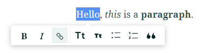

## About
Last Updated *[11/04/2019]*   
Created by [OSU Maps and Spatial Data](https://info.library.okstate.edu/map-room)

## Table of Contents
- Introduction 
- *[Story Mapping]*
- - Getting Started
- - Title Page
- - Adding Content
- - - Paragraph
- - - Heading
- - - Subheading
- - - Bulleted list
- - - Numbered list
- - - Quote
- - - Button
- - - Separator
- - - Image
- - - Map
- - - Video
- - - Embeded
- - - Sidecar
- - - Slideshow
- Conclusion
- Further Reading/Resources

## Introduction

## *[Story Mapping]*

#### Getting Started
1. To get started, go to [this website](https://storymaps.arcgis.com/stories) and log in to your Esri account. 
2. Select *Create new story*.

#### Title Page
1. In the new page that opens, add a title, and introduction and your name or department. The circle with two arrows can be used to change the placement of the title section.

2. If you have a certain image or video you would like to display as part of the title, you can select *Add image* or *Add video*

*Note: You can change the focal point of the image or video by clicking the **Properties** icon. Click where you would like the focal point and click **Save**.*

3. Once you're satisfied with your title page, scroll down. Here you will see an area where you can add content.

#### Adding Content
Next, we will go through each individual content type. For each of the following items, simply click the *add* icon and select the appropriate item.

##### Paragraph
1. Select *Paragraph*.
2. Simply type the paragraph you wish to include.

3. You can change the appearance of individual items by highlighting them and selecting certain options.

4. To make a word of phrase **bold**, select the **B**. 

5. To *italicize* something, select the *I*.

6. You can also make a word or phrase into a link. Select the *link* icon and then enter the URL.

7. You can make a paragraph into a *heading* by selecting the large *Tt* icon.

8. You can change it to a subheading by selecting the smaller *Tt* icon.

9. If you decide you want the paragraph to be a bulleted list item, select the *bullet* icon.

10. Select the *ordered list* icon to turn it into an ordered list item. 

11. The last option here is to turn the paragraph into a quote. Select the *"* icon.

##### Heading
1. Select *Heading*.
2. Type your desired heading.

##### Subheading
1. Select *Subheading*.
2. Type your desired subheading.

##### Bulleted list
1. Select *Bulleted list*.
2. Type your desired first bullet list item.
3. Hit *enter* to create a new bullet list item.

##### Numbered list
1. Select *Numbered list*.
2. Type your desired first numbered list item.
3. Hit *enter* to create a new numbered list item.

##### Quote
1. Select *Quote*.
2. Type the quote. 

##### Button
1. Select *Button*.
2. Type to text you want to appear on the button.
3. Type the URL you want the button to navigate to.

4. To delete, click the *trashcan* icon.

##### Separator
1. Select *Separator*.

2. You can delete separators just like buttons.
##### Image
1. Select *Image*.
2. Choose your desired image. 
3. Add a caption.

4. You can change the position and size of the picture by selecting different option. 

5. If you wish to have writing beside the image, select *float*.

6. If you wish to change the size, you can select *Small, Medium or Large*. *Small* is the default setting.

7. You can add alternative text, by selecting *Properties* and typing in the desired text. Click *Save*.

##### Map
1. Select *Map*.
2. Select a previously created map, or choose *Create an express map*.

3. A new view opens up. Here, there are many tools that can be used to customize your map.

4. Let's start by adding a point. Click the *Add a point* icon and click anywhere on the map to add a point. In the sidebar, you can add an image, name or description for your point and click *Done*. Hover over the point on the map to see the details you added.

5. If you're points need to be numbered to demonstrate a particular order, click the *Add numbered points* icon. The rest of the steps are the same as those for a basic point.

6. There are two ways to draw lines. The first way to draw a line is by clicking *Draw a line*. Place a point by clicking where you want the line to start and add points along each desired line segment. When you wish to finish the line, double click where you want the line to end. The rest of the steps are the same as those for a point.

7. You can also select *Draw a line freehand*. Draw your desired line on the map, but keep in mind that the line will look slightly different at the end. The rest of the steps are the same for points. If, however, you wish to modify the line, you can move the points by clicking on them and dragging them to the desired location.

8. You can also draw areas by selecting *Draw an area*. Place points the create the desired shape of the area by clicking where you wish the edges to be. Double click to end the area. The rest of the steps are the same for the other features. You can even edit the shap by dragging the points to the desired location.

9. You can *Draw an area freehand* as well in the same way as a freehand line. The other steps are the same.

10. If you want, you can *Add an annotation* to the map. Click where you want the annotation and type the desired annotation.

11. If you wish to *Draw an arrow*, click the icon and select the start and end points. You can warp the arrow by moving one or more of the points.

12. You can *Draw a two-headed arrow* in the exact same manner.

13. You can see all of your drawing layers in the sidebar. Here you can rename items or change the colors of layers.

14. In *Settings*, you can add a legend or change the basemap.

15. When you are satisfied with your map, choose *Place map*.

16. The rest of the display settings for a map are the same as for pictures.

##### Video
1. Select *Video*.
2. Paste in the iframe code or link to the desired video.
3. Click *Save*

4. Your video will appear on the story map. 

##### Embeded
1. Select *Embeded*.
2. Paste in the iframe code or link to the desired video.
3. Click *Save*

4. Your video will appear on the story map. 

##### Sidecar
1. Select *Sidecar*.
2. Go through the explanation slides that tell you what a sidecar is and click *Done*.

3. Add the desired text or features on the left hand side.
4. Select the desired image, video or map on the right hand side.

5. You can add other slides by clicking the *+* icon in the bottom right hand side of the screen.

6. Add as many slides as you wish. They can be reordered in the bottom pannel.

##### Slideshow
1. Select *Slideshow*.
2. Go through the explanation slides that tell you what a slideshow is and click *Done*.

3. Add a heading and subheading for the slideshow. You can change the position of the heading by clicking the arrows on the title box.

4. You can add background media or change the background color. 

5. You can add other slides by clicking the *+* icon in the bottom right hand side of the screen.

6. Add as many slides as you wish. They can be reordered in the bottom pannel.

#### Design
You can change the appearance of the story map by changing the design.
1. Click *Design*. 

2. Select your desired theme, cover style, accent color, font pairings and even upload a logo if you'd like!

#### Preview
1. Click *Preview*. 

2. Go through the presentation as a reader and look for things you would like to change. Be sure to check it on phone, tablet and desktop settings!
3. When you're done, click *Edit story*.

#### Publish
1. Click *Publish*. 

2. Decide who you wish can view your story.
3. Click *Publish story*.

4. If you decide to make any changes later on, you must publish those changes as well. 

## Conclusion
Story maps are a fun and interesting way to showcase your work!

## Further Reading/Resources
View the [presentation](https://storymaps.arcgis.com/stories/a246188990444be29e2835bc1c180ed6) I created for this guide. 

[Return to Top](#about)
