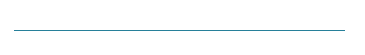
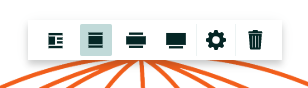

## About
Last Updated *[11/04/2019]*   
Created by [OSU Maps and Spatial Data](https://info.library.okstate.edu/map-room)

## Table of Contents
- Introduction 
- *[Story Mapping]*
- - Getting Started
- - Title Page
- - Adding Content
- - - Paragraph
- - - Heading
- - - Subheading
- - - Bulleted list
- - - Numbered list
- - - Quote
- - - Button
- - - Separator
- - - Image
- - - Map
- - - Video
- - - Embeded
- - - Sidecar
- - - Slideshow
- Conclusion
- Further Reading/Resources

## Introduction

## *[Story Mapping]*

#### Getting Started
1. To get started, go to [this website](https://storymaps.arcgis.com/stories) and log in to your Esri account. 
2. Select *Create new story*.

#### Title Page
1. In the new page that opens, add a title, and introduction and your name or department. The circle with two arrows can be used to change the placement of the title section.

2. If you have a certain image or video you would like to display as part of the title, you can select *Add image* or *Add video*

*Note: You can change the focal point of the image or video by clicking the **Properties** icon. Click where you would like the focal point and click **Save**.*

3. Once you're satisfied with your title page, scroll down. Here you will see an area where you can add content.

#### Adding Content
Next, we will go through each individual content type. For each of the following items, simply click the *add* icon and select the appropriate item.

##### Paragraph
1. Select *Paragraph*.
2. Simply type the paragraph you wish to include.

3. You can change the appearance of individual items by highlighting them and selecting certain options.

4. To make a word of phrase **bold**, select the **B**. 

5. To *italicize* something, select the *I*.

6. You can also make a word or phrase into a link. Select the *link* icon and then enter the URL.

7. You can make a paragraph into a *heading* by selecting the large *Tt* icon.

8. You can change it to a subheading by selecting the smaller *Tt* icon.

9. If you decide you want the paragraph to be a bulleted list item, select the *bullet* icon.

10. Select the *ordered list* icon to turn it into an ordered list item. 

11. The last option here is to turn the paragraph into a quote. Select the *"* icon.

##### Heading
1. Select *Heading*.
2. Type your desired heading.

##### Subheading
1. Select *Subheading*.
2. Type your desired subheading.

##### Bulleted list
1. Select *Bulleted list*.
2. Type your desired first bullet list item.
3. Hit *enter* to create a new bullet list item.

##### Numbered list
1. Select *Numbered list*.
2. Type your desired first numbered list item.
3. Hit *enter* to create a new numbered list item.

##### Quote
1. Select *Quote*.
2. Type the quote. 

##### Button
1. Select *Button*.
2. Type to text you want to appear on the button.
3. Type the URL you want the button to navigate to.

4. To delete, click the *trashcan* icon.

##### Separator
1. Select *Separator*.

2. You can delete separators just like buttons.
##### Image
1. Select *Image*.
2. Choose your desired image. 
3. Add a caption.

4. You can change the position and size of the picture by selecting different option. 

5. If you wish to have writing beside the image, select *float*.

6. If you wish to change the size, you can select *Small, Medium or Large*. *Small* is the default setting.

7. You can add alternative text, by selecting *Properties* and typing in the desired text. Click *Save*.

##### Map
1. Select *Map*.
##### Video
1. Select *Video*.
##### Embeded
1. Select *Embeded*.
##### Sidecar
1. Select *Sidecar*.
##### Slideshow
1. Select *Slideshow*.

## Conclusion

## Further Reading/Resources

[Return to Top](#about)
